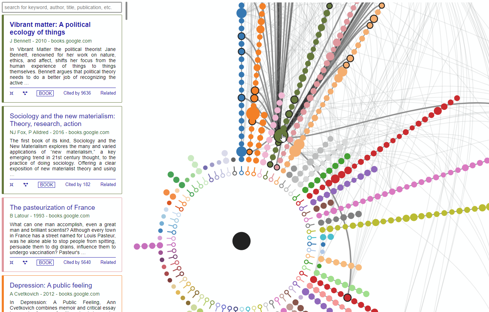

# Scholar Crawler
### Clustering and visualizing publication interdisciplinarity using the Louvain modularity of citation relations and node-link dependency graphs

While working on my thesis research, I had a difficult time mapping the interdisciplinary literature that pertained to my line of inquiry. This project was an attempt at navigating the perplexing landscape of theory, which later became an independent study of mapping the relations of canonical texts based on parsed/scraped data from Google Scholar.

The system is fed a collection of links obtained from Google Scholar based on user's scholarly interests. These links operate as seeds using which the system scrapes available information pertaining to the seed articles as well as their related literature and publications. The depth of scraping can be defined by the user. The scraped data is then cleaned and analyzed to extract communities of closely related literature. The resulting clusters and the graph data is converted to an easily parsable JSON file where a web-based interface facilitates the user's interaction with the collected data. 

This repository contains scraping code in Python and a web-based client-side visualization/navigation system built with D3. Relations are mapped using the [Louvain Method](https://en.wikipedia.org/wiki/Louvain_method) as provided by the `NetworkX` package. Scraping is facilitated through `Selenium` and the visualization is directly inspired by the [Hive Plot](https://bost.ocks.org/mike/hive/) with added interactivity. 

**Interactions:**
- Clicking on an entry (node/circle) will highlight all associated text from the dependency subgraph allowing to examine the cross-disciplinary influence of articles.
- Clicking on the central black circle shows the dependency graph in its entirety
- Clicking on the terminal empty circles at the end of each axis/ray will isolate that specific axis
- Clicking on a link between entries will isolate only those two related articles
- All interactions will result in the filtering of the info sidebar based on the scope of isolation
